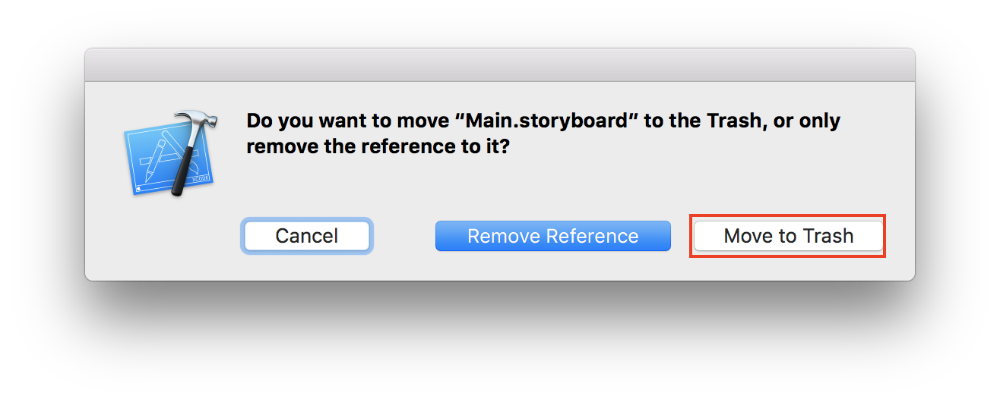

# iOS-templates  
iOS template projects, storyboard, xib, pure code use auto layout.  
  
## No storyboard projects  
#### step 1.  
  
Remove `Main.storyboard` from project and `Info.plist`.  
  
Click to `Info.plit`  
  
You click `-` to remove  

#### step 2.  
You write same this sample for `AppDelegate`.  
``` swift
import UIKit

@UIApplicationMain
class AppDelegate: UIResponder, UIApplicationDelegate {

    var window: UIWindow?

    func application(_ application: UIApplication, didFinishLaunchingWithOptions launchOptions: [UIApplicationLaunchOptionsKey: Any]?) -> Bool {
        window = UIWindow(frame: UIScreen.main.bounds)
        window?.rootViewController = ViewController()
        window?.makeKeyAndVisible()
        return true
    }
}
```

#### next steps  
[xib (xcode interface builder)](./docs/xib.md)  
[pure code](./docs/pureCode.md)  
[snapKit](./docs/snapKit.md)